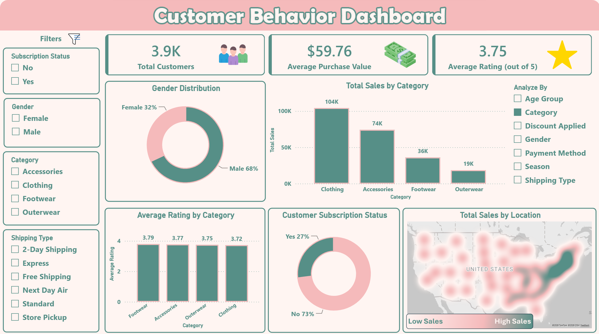

# 🛍️ Customer Shopping Behavior Analysis

## 📌 Project Overview

This project analyzes customer shopping behavior using transactional data from **3,900 purchases** across multiple product categories. The objective is to uncover insights into customer spending patterns, purchasing behavior, product preferences, subscription engagement, and revenue drivers to support data-driven business decisions.

The project follows a complete end-to-end analytics workflow, starting from data cleaning and exploration in Python, moving to business analysis in SQL Server, and ending with an interactive Power BI dashboard and business recommendations.

---

## 📊 Dashboard Preview

<p align="center">
  
</p>

*Interactive Power BI dashboard highlighting customer behavior, revenue trends, customer segmentation, subscription insights, and product performance.*

---

## 🛠️ Project Workflow

<p align="center">
  
</p>

*End-to-end analytics workflow from business understanding and data preparation to dashboard development, reporting, presentation, and GitHub deployment.*

---

## 🎯 Business Problem

Retail businesses need to better understand customer behavior in order to:

- Increase revenue and profitability
- Improve customer retention
- Optimize discount strategies
- Identify high-performing products
- Enhance subscription adoption
- Develop targeted marketing campaigns

This project leverages data analytics to transform raw transaction data into actionable business insights.

---

## 📊 Dataset Information

### Dataset Summary

- **Rows:** 3,900
- **Columns:** 18

### Key Features

#### Customer Demographics
- Age
- Gender
- Location
- Subscription Status

#### Purchase Information
- Item Purchased
- Category
- Purchase Amount
- Season
- Size
- Color

#### Shopping Behavior
- Discount Applied
- Previous Purchases
- Purchase Frequency
- Review Rating
- Shipping Type

### Data Quality

- 37 missing values in the `review_rating` column

---

## 🐍 Data Preparation & EDA (Python)

### Data Cleaning

- Imported and explored the dataset using Pandas
- Checked data structure and summary statistics
- Identified and handled missing values
- Standardized column names using snake_case naming convention

### Missing Value Handling

Missing values in the `review_rating` column were imputed using the median review rating within each product category.

### Feature Engineering

Created new analytical features:

- `age_group`
- `purchase_frequency_days`

### Data Consistency Checks

- Evaluated redundancy between:
  - `discount_applied`
  - `promo_code_used`
- Removed redundant columns

### Database Integration

- Connected Python to Microsoft SQL Server
- Loaded the cleaned dataset into SQL Server for analysis

---

## 🗄️ Business Analysis Using SQL

The cleaned dataset was analyzed in SQL Server to answer key business questions.

### Revenue Analysis

- Total revenue generated by male vs. female customers
- Revenue contribution by age group

### Customer Spending Analysis

- Customers who used discounts while spending above average
- Average spend and total revenue by subscription status

### Product Analysis

- Top 5 products with the highest average review ratings
- Top 3 most purchased products within each category

### Shipping Analysis

- Comparison between Standard and Express shipping purchase amounts

### Discount Analysis

- Products most dependent on discounts
- Impact of discounts on customer purchasing behavior

### Customer Segmentation

Customers were segmented into:

- New Customers
- Returning Customers
- Loyal Customers

based on purchase history and frequency.

### Subscription Behavior

- Investigated whether repeat buyers are more likely to subscribe

---

## 📈 Power BI Dashboard

An interactive Power BI dashboard was developed to visualize key metrics and insights.

### Dashboard Features

- Revenue Analysis
- Customer Demographics
- Customer Segmentation
- Subscription Insights
- Product Performance
- Shipping Preferences
- Discount Analysis

### Key KPIs

- Total Revenue
- Average Purchase Amount
- Subscriber Revenue
- Customer Segments
- Top Products
- Revenue by Age Group

---

## 🔑 Key Insights

- Subscriber customers represent a strong revenue opportunity.
- Loyal customers contribute significantly to overall sales.
- Some products rely heavily on discounts to drive purchases.
- Express shipping customers tend to spend slightly more than standard shipping users.
- Certain age groups generate a larger share of revenue.
- Highly rated products present valuable marketing opportunities.

---

## 💡 Business Recommendations

### Increase Subscription Adoption

Promote exclusive benefits and rewards for subscribers to improve retention and recurring revenue.

### Strengthen Customer Loyalty

Implement loyalty programs that encourage repeat purchases and move customers into the Loyal segment.

### Optimize Discount Strategy

Review discount effectiveness to balance increased sales volume with profitability.

### Improve Product Positioning

Feature top-rated and best-selling products prominently in marketing campaigns.

### Enhance Targeted Marketing

Focus marketing efforts on:

- High-value customer segments
- High-revenue age groups
- Frequent purchasers
- Potential subscribers

---

## 🧰 Tools & Technologies

| Tool | Purpose |
|--------|----------|
| Python | Data Cleaning & EDA |
| Microsoft SQL Server | Data Storage & Analysis |
| Power BI | Data Visualization |

---

## 📂 Project Structure

```text
Customer-Shopping-Behavior-Analysis/
│
├── dataset/
│   ├── raw_data.csv
│   └── cleaned_data.csv
│
├── images/
│   ├── dashboard_preview.png
│   └── project_workflow.png
│
├── notebooks/
│   └── customer_behavior_analysis.ipynb
│
├── sql/
│   └── business_queries.sql
│
├── powerbi/
│   └── dashboard.pbix
│
├── reports/
│   ├── Customer Shopping Behavior Analysis.pdf
│   └── Customer-Shopping-Behavior-Analysis.pptx
│
└── README.md
```

---

## 🚀 Project Outcome

This project demonstrates a complete end-to-end data analytics workflow that transforms raw customer transaction data into actionable business insights.

The workflow combines:

- Python for data preparation and exploratory analysis
- SQL Server for business-focused analysis
- Power BI for interactive dashboarding
- Reporting and presentation for stakeholder communication

The result is a comprehensive analytics solution that supports strategic retail decision-making through data-driven insights.

---

## 👤 Author

**Mazen Hamada**

Data Analyst | Power BI | SQL | Python

Connect with me on LinkedIn and explore more projects on GitHub.
